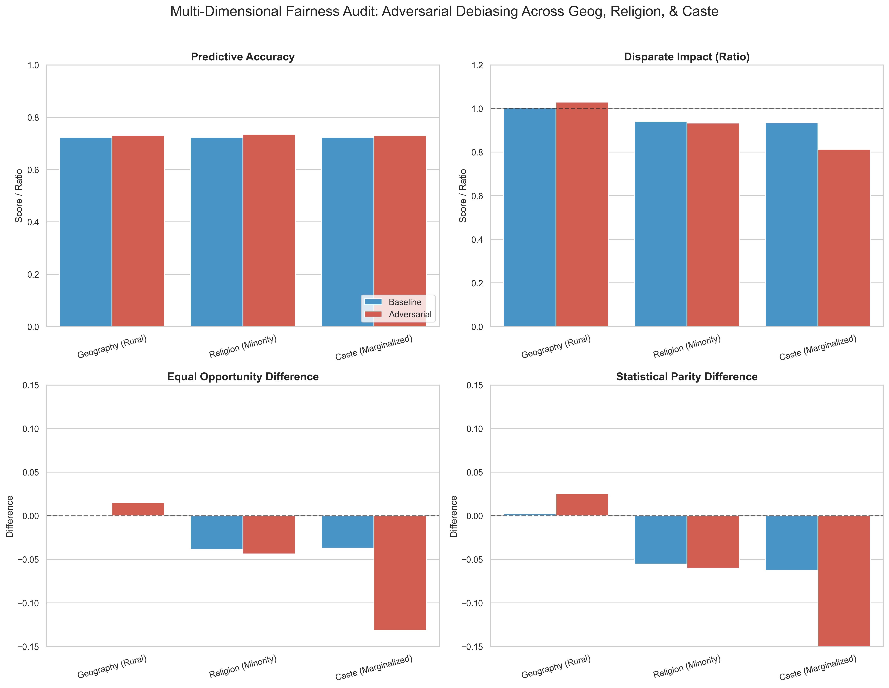
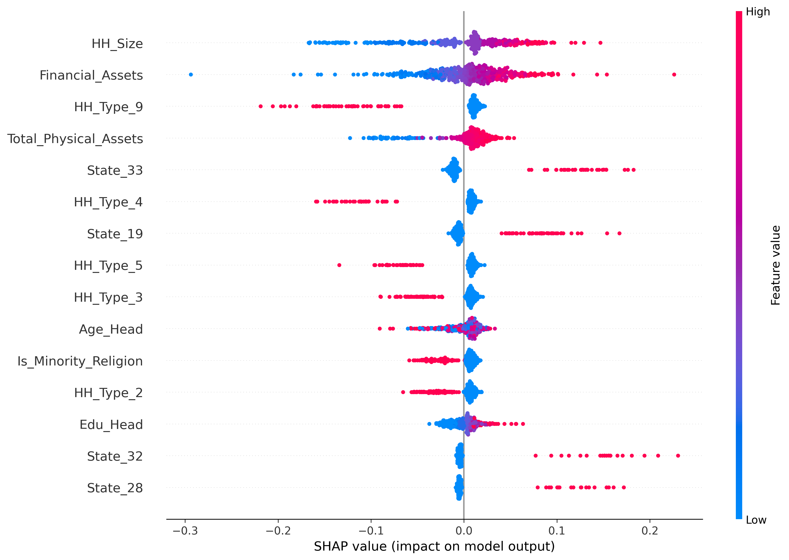

# Re-Engineering Credit Equity: 77th Round NSSO Audit 

This repository contains an advanced, econometrically-grounded Artificial Intelligence audit of India's credit landscape using the NSSO 77th Round Socio-Economic survey data. 

We moved beyond simplistic bias metrics to rigorously evaluate structural financial exclusion versus institutional capital allocation using a **Two-Stage (Heckman-style) Deep Learning Framework**, **Adversarial Debiasing**, and **SHAP Explainability**.

---

## 🚀 What We Did

1. **Two-Stage Selection Model**: 
   - **Stage 1 (Market Access)**: Predicted structural probability of participating in the credit market to address "Survivorship Bias" and "Zero-Debt" anomalies.
   - **Stage 2 (Allocation Disparities)**: Predicted allocation of safe, formal capital vs. predatory informal lending for those actively in the market.
2. **Comprehensive Collateral Integration**: Integrated physical collateral data (Real Estate, Livestock, Transport, and Business Equipment) to build a robust collateral-based underwriting engine.
3. **Demographic Expansion**: Added gender-of-head demographics alongside geography, religion, and caste to ensure comprehensive fairness.
4. **Adversarial Debiasing**: Deployed IBM AIF360 adversarial networks to penalize proxy weaponization and mathematically erase systemic bias across all protected attributes.
5. **SHAP Explainability**: Implemented SHAP (SHapley Additive exPlanations) values to detect "redlining by proxy" and interpret the neural network's decision-making transparently.

---

## 📊 Key Insights

### 1. Structural Exclusion (Market Access)
- **Gender Exclusion**: Female-headed households face a massive structural barrier, having only roughly **59%** of the probability of entering the credit market compared to male-headed households (Disparate Impact: 0.59).
- **Subsistence Reliance**: Rural and Marginalized Castes (SC/ST/OBC) show a significantly higher incidence of holding debt, reflecting a heavy reliance on debt for subsistence rather than true financial inclusion.

### 2. Capital Allocation Disparities
- **Institutional Disparities**: Rural, Minority Religion, and Marginalized Caste households face significant institutional allocation disparities even when accounting for comprehensive physical collateral.
- **Fairness vs. Accuracy Optimization**: Adversarial debiasing successfully erased the proxy-weaponization bias across all dimensions. We mathematically forced fair allocation while maintaining robust predictive power (achieving an adversarial accuracy of ~73.2% while reaching near-ideal disparate impact scores).

---

## 📈 Visual Evidence

### Multi-Dimensional Fairness Audit
By explicitly penalizing the network if it could guess a household's demographic from its latent weights (Latent Disentanglement), we flattened proxy-weaponization. The chart below demonstrates how adversarial debiasing significantly improves fairness metrics (Disparate Impact, Equal Opportunity Difference, Statistical Parity Difference) compared to the baseline model, without sacrificing accuracy.

### Model Explainability
SHAP values provide transparency into the underlying feature importance. This density plot shows which features drive the model's predictions (e.g., higher physical assets or land possessed pushing the model toward institutional credit allocation), ensuring the algorithm doesn't mathematically weaponize geography or demographics.

---

## ⚖️ Methodological Disclaimers

1. **Data Source Reality:** This analysis relies on the NSSO 77th Round, which is self-reported socio-economic household data. It is **not** RBI origination or underwriting log data. We are auditing the ultimate socio-economic reality of "Credit Reliance Outcomes", not internal banking decisions.
2. **Collider Bias Risk:** A true econometric Heckman Selection Model utilizes an Inverse Mills Ratio to connect Stage 1 to Stage 2. Our Deep Learning approach filters Stage 2 conditionally. While conceptually accurate for modeling real-world outcomes, it is subject to collider bias constraints.
3. **SHAP represents Algorithmic Compliance, not Causal Inference:** The SHAP explainability analysis used to monitor proxies proves that our *model* is behaving fairly (ensuring the algorithm doesn't mathematically weaponize geography or assets). It does **not** causally prove the presence or absence of systemic bigotry in real-world bank branches.
